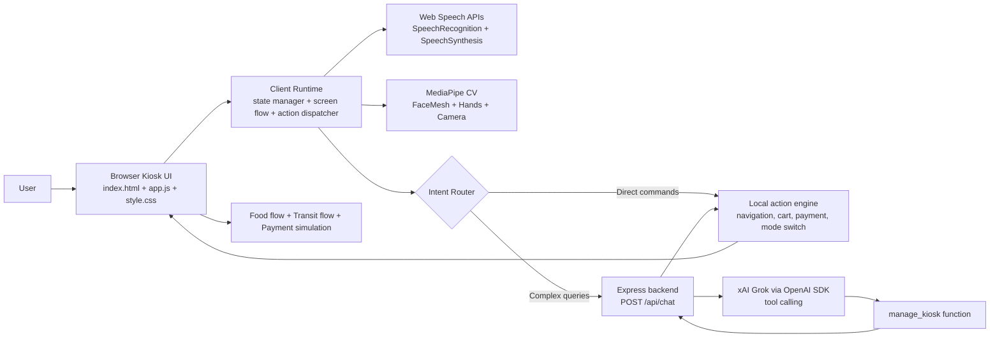
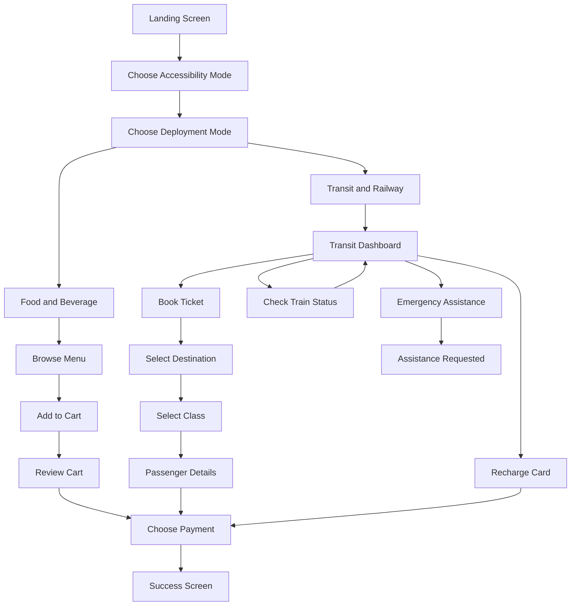

# Kiosk Vision

> An accessibility-first, AI-assisted self-service kiosk built for hackathon demos, inclusive design showcases, and future real-world pilots.

Kiosk Vision is a multimodal kiosk experience that helps users complete transactions independently across two deployment contexts:

- Food and beverage ordering
- Transit and railway assistance

The project combines voice interaction, gaze-based control, gesture input, adaptive UI states, and a cloud AI concierge to make kiosk interactions more inclusive for users with visual, motor, and cognitive accessibility needs.

## Why This Project Matters

Most kiosks assume every user can see clearly, tap precisely, read fast, and navigate crowded interfaces without assistance. In practice, that excludes a large group of people.

Kiosk Vision flips that model. Instead of forcing the user to adapt to the kiosk, the kiosk adapts to the user.

## What The Demo Includes

- Four accessibility modes: Standard, Visually Impaired, Cognitive Support, and Motor Impaired
- Dual service flows: food ordering and Indian Railways style transit assistance
- Voice-first interaction using speech recognition and text-to-speech
- Gaze dwell-click and hand-pinch interaction powered by computer vision
- Hybrid AI routing: local commands first, LLM only when the query is complex
- Payment simulation flows for UPI/NFC, card, cash, and wallet
- Side-panel observability with feature badges and an AI activity log

## Accessibility Modes

| Mode | User Need Addressed | Experience |
| --- | --- | --- |
| Standard | Default kiosk interaction | Touch-first flow with visual guidance |
| Visually Impaired | Low or no vision | Spoken guidance, screen announcements, microphone-driven commands |
| Cognitive Support | Reduced cognitive load | Larger cards, simplified layout, clearer steps, reduced choice density |
| Motor Impaired | Limited touch precision or no-touch interaction | Face-guided pointer, gaze dwell-click, hand tracking, pinch-to-select |

## Architecture Overview

Kiosk Vision is designed as a browser-based multimodal interface with a thin Express backend for AI orchestration.



## Interaction Flow



## System Design Notes

- The frontend is a single-page kiosk experience built with HTML, CSS, and JavaScript.
- The core runtime in `app.js` manages screen transitions, cart state, payment state, accessibility mode switching, and multimodal input handling.
- Voice UX is powered by browser-native Web Speech APIs for both input and spoken feedback.
- Motor accessibility is powered by MediaPipe FaceMesh and Hands for pointer movement, dwell-based selection, and pinch gestures.
- AI is used intentionally, not everywhere. Simple commands are handled locally for speed and cost efficiency. Complex questions are routed to the backend and then to Grok with tool calling.
- The backend exposes a single `/api/chat` endpoint and returns either spoken assistant content or structured UI actions.

## Key Innovation Highlights

- Local-first AI routing reduces latency and unnecessary LLM usage
- The same kiosk engine supports more than one domain without changing the interaction model
- Accessibility is not a separate add-on mode; it is built into the product architecture
- Multiple input systems coexist: touch, voice, gaze, and gesture
- The experience is demo-ready while still being structured for future integrations

## Tech Stack

| Layer | Technologies |
| --- | --- |
| Frontend | HTML, CSS, JavaScript |
| Tooling | Vite |
| Backend | Node.js, Express |
| AI Orchestration | OpenAI SDK configured for xAI Grok |
| Accessibility | Web Speech API |
| Computer Vision | MediaPipe FaceMesh, Hands, camera_utils, drawing_utils |
| UX Focus | Adaptive accessibility modes, multimodal interaction, kiosk-first layout |

## Repository Structure

```text
.
|-- app.js
|-- index.html
|-- style.css
|-- server.js
|-- src/
|   `-- utils/
|       `-- LocalIntentClassifier.js
|-- stitch/
|   |-- app.js
|   |-- index.html
|   |-- style.css
|   `-- stitch/
|       `-- synapse_pro/
|           `-- DESIGN.md
|-- package.json
`-- vite.config.js
```

## Getting Started

### 1. Install dependencies

```bash
npm install
```

### 2. Create a `.env` file

```env
XAI_API_KEY=your_xai_api_key
PORT=3000
```

### 3. Run the project

For the simplest full demo:

```bash
npm start
```

Then open:

```text
http://localhost:3000
```

For split frontend/backend development:

Terminal 1:

```bash
npm run dev:backend
```

Terminal 2:

```bash
npm run dev
```

Then open:

```text
http://localhost:5173
```

## Demo Requirements

- A modern Chromium-based browser is recommended
- Microphone permission is needed for speech input
- Camera permission is needed for gaze and hand tracking
- An `XAI_API_KEY` is needed for cloud AI concierge responses

## Prototype Scope

This repository is a high-quality prototype and hackathon demo, not a production deployment yet.

Current demo behavior includes simulated or prototype-style flows for:

- UPI/NFC payment confirmation
- IRCTC profile fetch
- Live train status
- Emergency assistance request

The strongest implemented value in the current build is the accessibility experience, multimodal interaction model, and local-first AI orchestration.

## Hackathon Positioning

Kiosk Vision is a strong hackathon project because it combines:

- Clear social impact through inclusive design
- Technical depth across AI, accessibility, frontend systems, and computer vision
- A polished demo flow with visible user-state transitions
- A practical path from prototype to real deployment in transit, retail, and public-service environments

## Future Roadmap

- Add multilingual voice support for Indian regional languages
- Integrate real payment gateways and confirmation workflows
- Connect live railway APIs for dynamic schedules and PNR status
- Add user analytics and accessibility usage insights
- Support profile-based personalization and repeat users
- Extend deployment templates for hospitals, airports, and government service kiosks

## Team

Built by:

- Saswat Dutta
- Aahan Samnotra
- Rishabh Surana
- Aiswarya Patro

## License

This project is licensed under the MIT License. See `LICENSE` for details.
